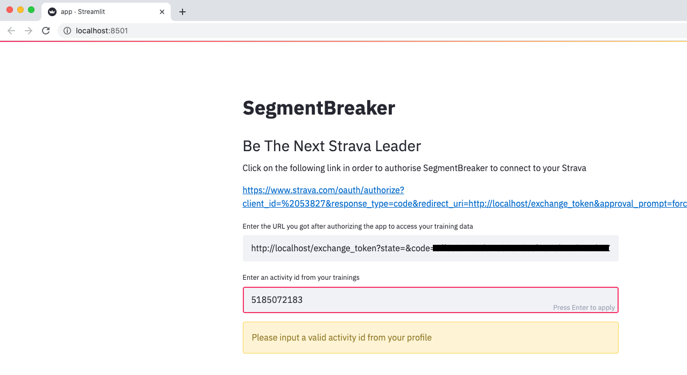

# Strava App

This application allows you to quickly analyse how close you were to the segment leaders from one activity of your choice. The application is going to rank the segments from your activity based on the difference between your time and the leader's time, so that the segments where your time was closest to the leader's are going to be at the top of the list.

### How to use the app

1. Go to the application URL: [https://strava-segment-breaker.herokuapp.com/](https://strava-segment-breaker.herokuapp.com/)

2. Click on the strava autorization link.


3. Click on Authorize in orther to allow the application to connect to your strava profile.


4. A new tab will open with an error page (this is expected). Copy the URL.


5. Go back to the application tab and paste the URL to the input section and click enter.


6. Add a valid Activity ID on the next input text box from the activity you want to analyse.



### How to run web app locally

Clone the repository, activate the virtual environment and run the app script
```bash
pipenv run streamlit run app.py
```

### How the app looks like


### TODO:

* Allow to select one activity from the athletes profile instead of having to input the Activity Id

## Author

* Pau Vilar (pau.vilar.ribo@gmail.com)